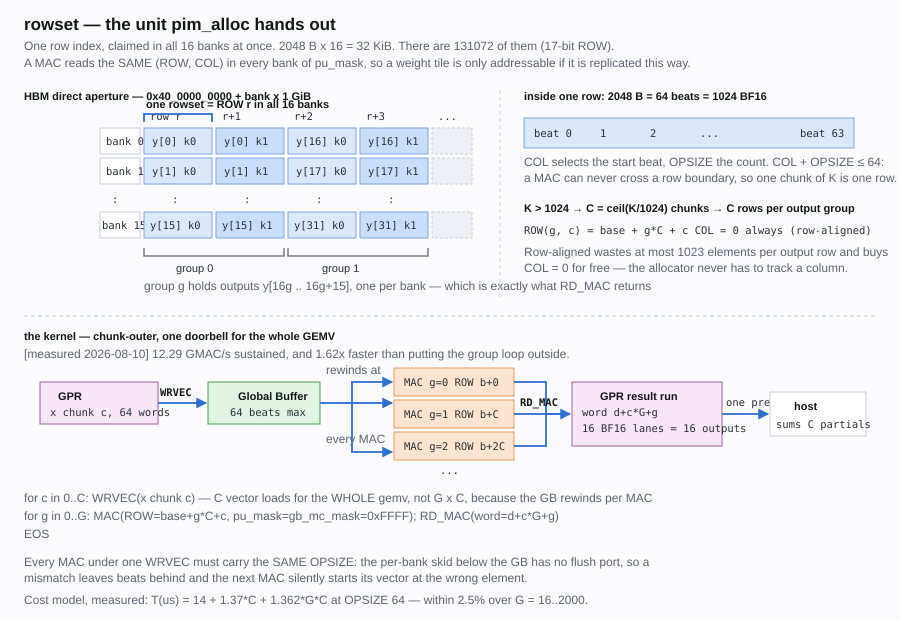

# PIM 위에서 LLM 을 돌리기 위한 SW 스택 — 제안

작성 2026-08-10. 대상 = `emulator_top/ch1`, r1p0 비트스트림.

출처 표기 — `[실측]` 오늘 이 보드에서 직접 측정, `[기존]` 다른 DUT 에서 이미
측정된 것, `[문서]` ISR 가이드가 적은 것, `[유도]` 계산, `[미확인]` 아직 아무도
확인하지 않음.

---

## 0. 한 문단 요약

이 하드웨어에는 **커널이 사실상 하나뿐이다 — GEMV**. LLM 디코드 단계에서 무게의
90 % 이상이 그 한 연산에 몰려 있으므로, 스택 전체가 "GEMV 하나를 잘 쏘는 법"으로
환원된다. 그래서 제안은 화려할 필요가 없다: **뱅크 16 개에 걸쳐 복제된 DRAM row
하나**를 할당 단위로 삼는 allocator, **GEMV 하나**를 내는 커널, 그리고 여러 GEMV 를
**하나의 IMEM 이미지로 묶어 한 번의 doorbell 로 쏘는** 실행 모델. 오늘 보드에서
이 커널을 **32000 x 2048 규모까지 한 번의 doorbell 로 돌려 전부 정답**을 받았고,
**12.29 GMAC/s** 를 지속했다.

---

## 1. 이미 있는 것 — "없을 것"이 아니다

`/home/kjy/pim/bank_controller/bank_controller_top/SW/` 에 **완성된 스택이 하나
있다.** Qwen3-0.6B 를 실제로 생성까지 돌린 물건이다.

| 파일 | 줄 | 무엇 |
|---|---|---|
| `libpim.c` / `.h` | 828 / 184 | 디바이스 GEMV + golden 모델 |
| `pim_dma.c` / `.h` | 478 / 238 | QDMA MM 전송 계층 |
| `pim.py` | 299 | ctypes 바인딩 |
| `pimtorch.py` | 257 | `nn.Linear` → 디바이스 (`PimLinear`) |
| `pimemu.py` | 75 | 디바이스 산술의 CPU 재현 |
| `run_qwen.py` | 158 | Qwen3-0.6B 생성, 디바이스 vs CPU 토큰 대조 |
| `measure_tokens.py` | 232 | 토큰 처리량 측정 |

**재사용 가능한 것**: 계층 구분, `PimLinear` 의 모양, golden 모델의 존재 이유,
HBM bump allocator, "가속이 아니라 산술이 토큰에 무슨 짓을 하는지 보는 것"이라는
문제 설정. 이건 이미 옳게 잡혀 있다.

**버려야 하는 것**: 전송 계층 전체. 그건 `bank_probe` **CSR 인터페이스**를 쓴다.
ch1 은 **ISR / IMEM / doorbell** 인터페이스다. 명령을 내리는 방식이 완전히 다르다.

**그리고 그 스택의 측정치를 근거로 쓰면 안 된다.** `bank_controller_top` 은
**뱅크 하나를 에뮬레이터에서 떼어내 독립적으로 돌린 DUT** 다 — 이 실리콘도 아니고
이 명령 경로도 아니다. §3.4 의 산술 성질은 전부 **ch1 에서 다시 쟀다.**

**그 안에 서로 모순되는 기록이 하나 있었고, 이제 판정됐다** — `pimemu.py` 머리말은
"strictly lane by lane in fp32", `run_qwen.py` 머리말은 "adder TREE" 라고 적어
정반대였다. ch1 에서 재보니 **`pimemu.py` 가 맞다** (§3.4). 그래서 그 golden 모델은
**그대로 쓸 수 있다** — 이 스택에서 재사용 가치가 가장 큰 부분이다. ch1 의
`emu_gemv.c` 도 tree 라고 적고 있었고, 고쳤다.

---

## 2. 하드웨어가 강제하는 것

설계 자유도가 거의 없다. 아래가 전부 강제 사항이다.

| # | 제약 | 소프트웨어에 강제되는 것 |
|---|---|---|
| C1 | MAC 은 `pu_mask` 의 모든 뱅크가 **같은 (ROW, COL)** 을 읽는다 | 할당 단위가 바이트가 아니라 **16 뱅크에 복제된 row** 다 |
| C2 | `RD_MAC` 은 16 뱅크 lane 을 한 워드로 모은다 (lane i = 뱅크 i) | 출력 `y[n]` 은 뱅크 `n mod 16` 에 있어야 한다. 이 분할만이 되읽기를 연속으로 만든다 |
| C3 | `COL + OPSIZE ≤ 64` | 한 MAC 은 DRAM row 를 넘지 못한다 → K 는 1024 개씩 쪼개진다 |
| C4 | GB 깊이 64 beat | GB 소싱 벡터는 ≤ 1024 원소 |
| C5 | 누산 latch 가 **뱅크당 하나** (T 가 `1'b0` 로 고정) | 동시에 살아 있는 출력 그룹은 하나뿐 |
| C6 | `RD_MAC` 은 read-clear | 누산기는 RD_MAC 과 리셋으로만 비워진다 — **doorbell 을 건너 남아 있는 상태다** |
| C7 | ROW 17 비트 | ISR 이 닿는 범위는 뱅크당 256 MiB, 총 **4 GiB = 2 G BF16** |
| C8 | IMEM 16384 워드, base 레지스터 **없음** | 모든 프로그램은 word 0 에서 시작한다. 여러 프로그램을 상주시킬 수 없다 |
| C9 | 유효성 게이트가 **하드웨어에 없다** | 규칙 위반은 조용히 틀린 숫자거나 hang 이고 구분할 방법이 없다 |
| C10 | GB 아래 per-bank skid 에 flush 포트가 없다 `[문서]` | **한 WRVEC 을 소비하는 모든 MAC 의 OPSIZE 가 같아야 한다** |
| C11 | `T_CCD < 2` 면 결과가 조용히 절반이 된다 `[문서]` | 타이밍 레지스터는 런타임이 잠가야 한다 |
| C12 | ISR 은 single-outstanding | 파이프라이닝이 없다. 모든 ISR 의 지연이 임계 경로다 |

opcode 는 `MAC / EWMUL / COPY / WRVEC / RD_MAC / EOS` 가 전부다. **덧셈도, 나눗셈도,
exp 도, rsqrt 도, lane 치환도 없다.** 이것이 아래 §8 의 host/device 분할을 전부
결정한다.

---

## 3. 오늘 보드에서 확인한 합성 규칙 `[실측 2026-08-10]`

프로그램이 4 워드보다 길어지는 순간 걸리는 규칙 넷을 `emu_chain` 으로 물었다.
`emu_gemv` 는 MAC 을 한 발만 쏘므로 이 넷 중 어느 것도 관측하지 못한다.

| 프로브 | 물음 | 결과 |
|---|---|---|
| `chain` | `MAC \| MAC \| RD_MAC` — 누산기가 ISR 을 건너 살아남나 | **통과.** 정확히 2 배. 살아남는다 |
| `rewind` | 한 WRVEC 이 MAC 여러 발을 먹이나 | **통과.** 두 번째 MAC 도 같은 값. GB 가 되감긴다 |
| `kchunk` | `WRVEC(1.0)\|MAC\|WRVEC(2.0)\|MAC\|RD_MAC` — K 분할 | **통과.** 두 번째 벡터가 반영됐다 |
| `gemv` | WRVEC 하나 + G × {MAC, RD_MAC} | **통과.** G = 2000 까지, 전 lane 정답 |

이 넷이 통과했다는 것이 **§0 의 프로그래밍 모델이 성립한다는 근거**다. 특히
`rewind` 는 ISR 가이드가 적어두기만 하고 아무도 실행한 적 없던 것이고, 이게
거짓이었다면 GEMV 하나에 벡터 적재가 `N/16` 번 필요해서 비용 모델이 완전히 달라진다.

### 3.1 규모와 처리량 `[실측]`

전부 **한 번의 doorbell**, 전 출력 lane 대조.

| N (출력) | K | ISR | 시간 | GMAC/s | 판정 |
|---|---|---|---|---|---|
| 256 | 1024 | 34 | 40 µs | 6.55 | PASS |
| 1024 | 1024 | 130 | 100 µs | 10.49 | PASS |
| 4096 | 1024 | 514 | 357 µs | 11.75 | PASS |
| 16384 | 1024 | 2050 | 1388 µs | 12.09 | PASS |
| 2048 | 4096 | 1029 | 698 µs | 12.02 | PASS |
| **32000** | **2048** | **8003** | **5334 µs** | **12.29** | **PASS** |

마지막 줄이 TinyLlama-1.1B 의 `lm_head` 형상 그대로다.

### 3.2 비용 모델 `[실측, 회귀]`

`L` = beat/MAC, `G` = 출력 그룹, `C` = K 분할 수.

```
T(µs) ≈ 14 + 1.37·C + G·C·(0.543 + 0.0128·L)
                                └ RD_MAC + row activate  └ beat 당
```

`L = 64` 에서 `T ≈ 14 + 1.37·C + 1.362·G·C`. **G = 16 ~ 2000 구간에서 오차 2.5 % 이내.**

읽히는 것:

- **beat 당 12.77 ns** = 200 MHz 에서 2.55 사이클. `T_CCD = 2` 바닥에 가깝다 —
  데이터패스는 이미 발행 한계 근처에서 돈다.
- **이 수치가 클럭 모호성을 해소한다.** 저장소에 150 MHz 와 200 MHz 가 함께 적혀
  있는데, 150 MHz 라면 12.77 ns 는 1.92 사이클이 되어 `T_CCD = 2` 바닥 아래다.
  **불가능하다. 클럭은 150 MHz 가 아니다.**
- **그룹당 고정비 543 ns 가 지배적이다.** 64-beat MAC 의 유효 시간이 819 ns 이므로
  `L = 64` 에서도 효율은 60 % 다. `L < 42` 면 고정비가 연산보다 크다 →
  **K 는 항상 1024 씩 꽉 채워 쓴다.**
- **64-beat WRVEC ≈ 1.37 µs.** MAC 보다 비싸다. 이게 아래 §6 의 루프 순서를 결정한다.

### 3.3 루프 순서 — 측정으로 판정 `[실측]`

`N = 2048`, `L = 64`:

| K | group-outer | chunk-outer | |
|---|---|---|---|
| 2048 (C=2) | 579 µs, 7.24 GMAC/s | **357 µs, 11.75** | 1.62× |
| 4096 (C=4) | 1141 µs, 7.35 | **698 µs, 12.02** | 1.63× |

group-outer 는 `G·C` 번 벡터를 다시 싣는다. chunk-outer 는 `C` 번만 싣는다.
**chunk-outer 가 K 와 무관하게 12 GMAC/s 를 유지한다.**

대가는 §3.5 에서 쟀다: 출력의 9~27 % 가 **1 ulp** 어긋나고, 그 이상은 없다.

### 3.4 산술 — ch1 에서 직접 잰 것 `[실측]`

**누산기는 BF16 보다 넓고, ISR 을 건너서도 그렇다.** 진행 중인 합의 half-ulp 아래인
항들(`2^-9`)로 물었다 — BF16 누산기라면 전부 버려져 정확히 `1.0` 이 나온다. K =
16/64/256/1024 네 지점 모두 닫힌 형태 `1 + (K-1)/512` 와 일치했고, `MAC(1.0)` 뒤에
`MAC(2^-9)` 여덟 발도 `1 + 8·2^-9` 로 나왔다. **K 를 쪼개 연쇄해도 폭을 잃지 않는다.**

**누산 순서는 순차다 — adder tree 가 아니다.** 무작위 데이터로는 판정이 안 된다
(출력이 BF16 8 비트라 fp32 순서 차이가 묻히고, 현실 분포에서 모델끼리 갈리는 lane 이
4096 중 1 개다). 후보들이 **아예 다른 답**을 내도록 벡터를 지어서 물었다:

| 벡터 | 디바이스 | 배제 |
|---|---|---|
| 대조군 — `ε` lane 만, 나머지 0 | `0.03125` = 전 모델 예측 | `ε` 는 flush 되지 않는다 |
| `ε` 를 lane 0,1 에 | `0` | adjacent tree `(2i,2i+1)` |
| `ε` 를 lane 0,8 에 | `0` | halves tree `(i,i+n/2)` |

**표준 16-lane adder tree 배선 두 가지가 배제되고 순차 fp32 가 전부 일치한다.**
설계 의도(곱셈 lane → adder tree → MAC)와 어긋나므로 트리가 균형 이진 트리가 아니라
**파이프라인 가산기 체인**일 가능성이 높다 — 확인할 가치가 있다.

**golden 모델**은 따라서:

```c
float acc = 0.0f;                                  // fp32, 폭은 BF16 보다 넓다
for (unsigned k = 0; k < K; k++)                   // lane 순서 그대로
    acc += bf16_to_f32(w[k]) * bf16_to_f32(x[k]);  // 곱은 정확
return f32_to_bf16(acc);                           // RNE 한 번, RD_MAC 에서
```

`emu_gemv.c` 의 `tree_sum` 은 이 발견으로 `device_sum` 으로 고쳤다. 그 도구의 시험
피연산자는 전부 정확해서 숫자는 안 바뀌지만, 주석이 틀린 것을 가리키고 있었다.

### 3.5 K 분할 — 속도와 정확도의 교환 `[실측]`

`N=1024`, 무작위 정규 피연산자, 기준은 위 golden:

| C | K | group-outer | chunk-outer | 속도 |
|---|---|---|---|---|
| 2 | 2048 | **정확** 0/1024 | 26.8 % 가 1 ulp | 1.36× |
| 4 | 4096 | **정확** 0/1024 | 16.9 % 가 1 ulp | 1.38× |
| 6 | 6144 | **정확** 0/1024 | 8.9 % 가 1 ulp | 1.41× |
| 8 | 8192 | **정확** 0/1024 | 9.4 % 가 1 ulp | 1.43× |

- **group-outer 는 golden 과 bit-exact 다.** 연쇄가 폭을 안 잃는다는 것과, golden 이
  맞다는 것을 동시에 확인해 준다
- **chunk-outer 의 오차는 어떤 C 에서도 1 ulp 를 넘지 않고**, C 가 커질수록 오차율은
  오히려 줄어든다
- 속도 이득은 `G` 와 함께 커진다 (G=64 에서 1.4×, **G=128 에서 1.63×**). LLM 형상은
  G = 128~704 이므로 1.6× 쪽이다

**결론: 기본은 chunk-outer, `--exact` 는 group-outer.** 후자가 bit-exact 라서
"디바이스가 틀렸다" 와 "스케줄이 손해다" 를 가를 수 있다 — 검증 게이트가 없는
하드웨어에서 이 구분이 가능한 것은 값이 크다.

### 3.6 가중치 업로드 `[실측]`

| 방식 | 64 row | 대역폭 |
|---|---|---|
| row 마다 한 번씩 (1024 회 × 2 KB) | 13.9 ms | ~150 MB/s |
| **뱅크마다 한 번씩 (16 회 연속)** | **0.4 ms** | **최대 4097 MB/s** |

**35 배 차이다.** 레이아웃이 뱅크별 슬라이스를 연속으로 만들지 못하면 모델 적재가
불가능해진다. 이게 §4 의 레이아웃을 강제한다.

---

## 4. 메모리 모델 — `pim_alloc`



### 4.1 할당 단위는 바이트가 아니다

C1 때문에, "뱅크 3 에 8 KB" 같은 할당은 **의미가 없다**. MAC 이 그걸 읽을 방법이
없기 때문이다. 유일하게 쓸모 있는 단위는:

> **rowset = row 인덱스 하나를 16 뱅크 전부에서 점유한 것.**
> 2048 B × 16 = **32 KiB**, BF16 16384 개. 총 **131072 개**.

디바이스 주소 공간은 "16 GiB 의 바이트"가 아니라 **`[0, 131072)` 의 row 인덱스 하나**다.
이게 이 제안에서 가장 중요한 한 줄이다.

```c
typedef struct { uint32_t row; uint32_t nrows; } pim_buf;

const char *pim_alloc(pim_dev *d, uint32_t nrows, pim_buf *out);
void        pim_free (pim_dev *d, pim_buf *b);
```

`nrows` 단위이지 바이트 단위가 아닌 것이 요점이다. 바이트를 받는 API 는 호출자에게
`/32768` 을 하게 만들고, 그건 반올림 실수가 조용한 오답이 되는 자리다.

### 4.2 가중치 텐서 레이아웃

`W[N][K]` 에 대해:

```
G = ceil(N / 16)          출력 그룹 수
C = ceil(K / 1024)        K 분할 수
nrows = G * C

W[16g+b][1024c : 1024(c+1)]  →  뱅크 b, ROW = base + g*C + c, COL = 0
```

- `N` 은 16 의 배수로 **0 패딩**한다. 패딩 출력은 계산되고 버려진다.
- `K` 는 1024 의 배수로 **0 패딩**한다. 내적에서 0 은 무해하다.
- **COL 은 항상 0** — row 정렬. 낭비는 출력 행당 최대 1023 원소로 묶이고, 대신
  allocator 가 컬럼을 추적할 필요가 영영 없어진다. C3 때문에 조밀 패킹을 해도
  어차피 row 경계에서 쪼개야 하므로, 얻는 게 거의 없는 복잡도다.
- **뱅크 b 의 슬라이스 `G*C` row 가 연속**이므로 업로드는 뱅크당 pwrite 하나다
  (§3.4 의 35 배가 여기서 나온다).

```c
typedef struct {
    pim_buf  buf;
    uint32_t n, k;          // 논리 크기
    uint32_t ngroups;       // G
    uint32_t nchunks;       // C
    uint16_t tail_opsize;   // 마지막 청크의 OPSIZE (K%1024 처리)
} pim_weight;

const char *pim_weight_alloc (pim_dev*, uint32_t n, uint32_t k, pim_weight *out);
const char *pim_weight_upload(pim_dev*, pim_weight*, const uint16_t *bf16_row_major);
```

### 4.3 ROW 를 만드는 유일한 통로

C9 (게이트 없음) 에 대한 대응은 **검사보다 구성**이다. ISR 의 ROW 필드는 base 도
bound 도 담지 않으므로, 잘못된 base 는 남의 텐서를 읽고 아무도 모른다.

```c
// 텐서 핸들에서 ROW 를 얻는 유일하게 승인된 경로.  g >= ngroups 또는
// c >= nchunks 면 실패한다.  런타임 어디에서도 base + 산수를 직접 하지 않는다.
const char *pim_row_of(const pim_weight *w, uint32_t g, uint32_t c, uint32_t *row);
```

그리고 `emu_regs.h` 의 `emu_isr_set` 을 **비공개로 내린다**. 256 비트 워드를 만들 수
있는 것은 `pim_emit_*` 뿐이 되게 해서, 손으로 조립한 ISR 이 *탐지 대상*이 아니라
*표현 불가능*이 되게 한다.

### 4.4 용량

| | |
|---|---|
| ISR 이 닿는 총량 | 131072 row × 32 KiB = **4 GiB = 2.15 G BF16** |
| TinyLlama-1.1B | 2.20 GB → **51 %**, 패딩 포함 약 55 % — **들어간다** |
| Qwen2.5-0.5B | 0.99 GB → 23 % — 넉넉하다 |
| Llama-3.2-1B | 2.47 GB → 58 % — 들어간다 |
| Llama-3-8B | 15.0 GB → **3.3 배 초과, 안 된다** |

INT8/INT4 데이터패스가 없으므로 양자화로 늘릴 수 없다. **1 ~ 1.5 B 가 상한**이다.

`[미확인]` 4 GiB 는 **인코딩 한계이고 아직 끝까지 써본 적이 없다.** 오늘 실행이
row 4315 까지 닿았고 (그 전 최대는 300), 131071 까지 실제 DRAM 에 닿는지는 확인되지
않았다. 모델을 올리기 전에 `emu_hbm_direct` 를 row 상한 근처까지 돌려야 한다.

---

## 5. 연산 함수

커널은 **하나**다. 나머지는 그 위의 편의 함수다.

```c
// y[0..n) = W[n][k] · x[0..k)   — BF16 in, BF16 out
const char *pim_gemv(pim_dev*, const pim_weight *W,
                     const uint16_t *x, uint16_t *y);

// 같은 x 를 여러 W 에 — 하나의 doorbell, 벡터 적재도 한 번
//   qkv 와 gate/up 이 정확히 이 모양이다
const char *pim_gemv_multi(pim_dev*, const pim_weight *const *Ws, unsigned nw,
                           const uint16_t *x, uint16_t *const *ys);
```

`EWMUL` / `COPY` 는 API 에 **넣지 않는다**. §8 에서 LLM 디코드에 쓸 자리가 없음을
보인다. 넣어두면 쓰라고 부추기는 것밖에 안 된다.

Python:

```python
w = dev.upload_weight(linear.weight)      # torch.Tensor[N,K] bf16 -> pim_weight
y = dev.gemv(w, x)                        # torch.Tensor[K] -> torch.Tensor[N]
q, k, v = dev.gemv_multi([wq, wk, wv], x) # 한 번의 doorbell
```

---

## 6. 프로그래밍 모델 — record-then-launch

**eager 가 아니다.** doorbell 하나의 고정비가 프로그램 길이와 무관하게 존재하고
(14 µs + IMEM 적재), 한 프로그램 안에서 여러 GEMV 를 묶으면 그게 통째로 사라진다.

```python
with dev.program() as p:
    q = p.gemv(wq, x)      # 아직 아무 일도 안 일어난다
    k = p.gemv(wk, x)      # x 가 같으므로 WRVEC 을 공유한다
    v = p.gemv(wv, x)
p.run()                    # ISR 을 만들고, IMEM 에 쓰고, doorbell 하나
```

기록되는 것은 **값이 아니라 GPR 주소**다. 따라서 같은 프로그램의 IMEM 이미지는
매 토큰 **바이트 단위로 동일**하다 — 모델 적재 시점에 한 번 인코딩해두고 매 토큰
그 바이트를 DMA 만 하면 된다. 토큰당 ISR 이 수만 개이므로 `emu_isr_build` +
`emu_isr_check` 를 매번 도는 것은 밀리초 단위 낭비다.

### 6.1 발행 규칙

한 프로그램 안에서 (chunk-outer):

```
for c in 0..C:
    WRVEC(x 청크 c, OPSIZE = L_c)
    for g in 0..G:
        MAC   (ROW = pim_row_of(W, g, c), COL = 0, OPSIZE = L_c,
               pu_mask = gb_mc_mask = 0xFFFF)
        RD_MAC(GPR_ADDR = dst + c*G + g)
EOS
```

- **`pu_mask = gb_mc_mask = 0xFFFF` 만 쓴다.** 단일 뱅크와 4 뱅크 모양은 이
  작업에서는 함정이다 — RD_MAC 은 전 뱅크에 broadcast 되므로, 참여하지 않은
  뱅크의 latch 를 매번 같이 걷어야 한다.
- **한 WRVEC 아래 모든 MAC 의 OPSIZE 가 같다** (C10). chunk-outer 는 청크가 바깥
  루프이므로 이 규칙을 **구조적으로** 만족한다 — `K % 1024 ≠ 0` 인 꼬리 청크도
  자기 WRVEC 과 짝지어 짧은 OPSIZE 로 일관되게 돈다.
- **결과 GPR 워드는 항상 연속**이다. GEMV 전체 결과가 pread 하나가 된다.
  워드마다 따로 읽으면 연산보다 전송이 비싸진다.

### 6.2 doorbell 을 건너는 상태 — 반드시 정해야 하는 규약

C6 때문에 누산기는 **프로그램 사이에 남는다.** 위 루프는 MAC 마다 RD_MAC 을
짝지으므로 정상 종료 시 깨끗하다. 하지만 **프로그램이 중간에 죽으면 latch 가
더럽고, 다음 프로그램의 첫 RD_MAC 이 남의 부분합을 얹어서 돌려준다.**
탐지 수단이 없다.

규약: **런타임은 실패한 launch 뒤에 반드시 버리는 RD_MAC 하나로 시작하는 프로그램을
쏴서 latch 를 비운다.** 그리고 이 상태는 프로세스 밖에도 남으므로, `pim_dev` 를
열 때도 같은 청소를 한다.

### 6.3 launch 가 하는 일

```
1. require_idle()            — 디스패처가 놀고 있어야 한다.  살아 있는 커널 위에
                               IMEM 을 쓰면 WREADY 에서 멈추고 10 초 뒤 EIO 가
                               H2C 엔진을 래치한다
2. IMEM ← 미리 인코딩된 바이트 (word 0 부터)
3. 결과 GPR 구간을 poison 으로 채운다 (한 번의 pwrite)
4. PROG_LEN 쓰고, 되읽어 확인하고, non-posted 읽기로 순서를 잠근다
5. doorbell
6. STATUS[31] 폴 — MMIO, 공짜
7. 결과 구간을 한 번의 pread — poison 이 사라진 것이 성공 판정이다.
   STATUS[31] 은 마지막 ISR 을 "받았을 때" 서므로 판정에 쓰지 않는다
```

---

## 7. 계층

| L | 이름 | 언어 | 책임 | 상태 |
|---|---|---|---|---|
| 0 | `emu_regs.h` | C 헤더 | 주소 맵, ISR 인코더, opcode별 합법성 | **있음** |
| 1 | `pim_dev` | C | BAR2 mmap, 두 큐, CFR, IMEM/GPR/HBM 전송, 타이밍 잠금 | 새로 |
| 2 | `pim_alloc` | C | rowset allocator, `pim_weight`, `pim_row_of` | 새로 |
| 3 | `pim_prog` | C | ISR 발행, 프로그램 검증기, launch | 새로 |
| 4 | `pim_gemv` | C | GEMV 스케줄 (chunk-outer), `gemv_multi` | 새로 |
| 5 | `libpim.so` + `pim.py` | ctypes | Python 바인딩 | 새로 (기존 것 참고) |
| 6 | `pimtorch.py` | Python | `PimLinear`, HF 모델 패치 | 기존 것 개작 |
| 7 | `pimemu.py` | Python | 디바이스 산술의 CPU 재현 (golden) | **기존 것이 맞다** (§3.4) |

`pim` conda 환경에 torch 2.13+cpu / transformers 5.14 / safetensors 가 이미 있으므로
6 번 층에서 바로 HF 모델이 돈다. pybind11 도 cython 도 없으니 **ctypes** 로 간다 —
경계에서 넘기는 게 포인터와 길이뿐이라 충분하다.

### 7.1 `PimLinear` 는 조용히 host 로 떨어져야 한다

```python
def forward(self, x):
    if x.shape[:-1].numel() != 1:      # prefill, batch > 1
        return F.linear(x, self.cpu_weight, self.bias)
    return self.dev.gemv(self.w, x)
```

이 한 줄이 스택을 **점진적**으로 만든다. Linear 를 **하나만** 바꿔도 모델이 옳은
텍스트를 내고, prefill 은 첫날부터 동작하며, 어느 Linear 에서 처음 어긋나는지를
이분 탐색으로 찾을 수 있다. 전부 바꿔야 처음 돌아가는 설계는 디버깅이 불가능하다.

---

## 8. LLM 매핑 — 무엇이 device 로 가나

| 연산 | 어디 | 이유 |
|---|---|---|
| **Q/K/V 투영** | **device** | GEMV. x 를 공유하므로 **한 프로그램** |
| **O 투영** | **device** | GEMV |
| **gate / up 투영** | **device** | GEMV. x 를 공유하므로 **한 프로그램** |
| **down 투영** | **device** | GEMV. K 가 커서 C 가 크다 |
| **lm_head** | **device** | 토큰 MAC 의 21~28 %. 가장 좋은 후보 |
| RMSNorm | host | rsqrt 없음. **weight 는 다음 투영에 미리 접어 넣는다** (`W' = W·diag(w)`) |
| RoPE | host | sin/cos 없음, 뺄셈 없음, **lane 치환 없음** — 셋 다 없다 |
| softmax | host | exp / max-reduce / 나눗셈 없음 |
| SiLU | host | sigmoid 없음 |
| residual add | host | **덧셈 opcode 가 없다** |
| gate ⊙ up | host | §8.2 |
| attention `q·Kᵀ` | host | §8.1 |
| attention `p·V` | host | §8.1 — **구조적으로 불가능** |

디코드 한 층당 **호스트 동기점 4 개**, 즉 doorbell 4 개다. 이건 IMEM 용량이 아니라
**빠진 산술** 이 정하는 바닥이다.

### 8.1 attention 은 host 에 영구히 남는다 — v1 한정이 아니다

`q·Kᵀ` 는 매핑은 된다. 그런데 세 번 진다:

1. **softmax 가 device 에 없으므로 점수가 전부 돌아와야 한다.** S = 2048 에서
   토큰당 2.10 MB, GPR 읽기 909 MB/s 로 **2.31 ms** — 호스트가 attention 전체를
   하는 시간과 이미 같다. PIM MAC 을 한 번도 세기 전에.
2. **ISR 수가 프로그램 한도를 넘는다.** 층당 `h·(1 + 2S/16)` = S=2048 에서 8224,
   S=8192 에서 32800. `PROG_LEN` 은 16383 이다.
3. `head_dim = 64` 는 OPSIZE = 4 라 발행 효율이 25 % 다 (OPSIZE=64 는 84 %).

**`p·V` 는 아예 표현이 안 된다.** MAC 은 뱅크 *안에서* beat 를 따라 스칼라 하나로
줄인다. 그런데 `p·V` 의 축약 축은 **position** 이고 그건 뱅크를 *가로지른다*.
축약 축을 뱅크 안에 넣는 레이아웃 (V 전치) 을 쓰면 이번엔 position 하나를 덧붙이는
데 512 개의 서로 다른 row 에 BF16 하나씩 써야 하는데, 슬레이브에 WSTRB 가 없어서
전부 read-modify-write 다. **K 는 position-major 를 원하고 V 는 dimension-major 를
원한다. 둘 다는 안 된다.** 게다가 벡터 누산기 자체가 없다 (AXPY 원시연산이 없다).

이걸 되돌리려면 새 하드웨어가 필요하다 — exp/max/divide 경로, 그리고 뱅크 간
축약이나 벡터 누산기 + WSTRB. **소프트웨어로 해결되지 않는다.**

### 8.2 EWMUL 은 LLM 디코드에 쓸 자리가 없다

EWMUL 의 전제는 **두 피연산자가 이미 뱅크 DRAM 의 같은 (ROW, COL) 에 있는 것**이다.
디코드 한 층의 원소별 곱을 전부 세어보면:

| | 왜 안 되나 |
|---|---|
| RMSNorm scale | `x` 가 그 스텝에 호스트가 만든 것 |
| RoPE cos/sin | `q,k` 가 호스트 산물이고, 짝짓기가 **lane 을 가로지른다** |
| SwiGLU `gate ⊙ up` | `gate` 는 SiLU 를 거쳐야 하고 SiLU 는 host 전용 |

**셋 다 최소 한쪽 피연산자가 그 스텝에 호스트가 갓 만든 값이다. 전제가 한 번도
성립하지 않는다.** 가장 유리한 경우 (`gate ⊙ up`, d=5632) 로 계산해도 왕복 약
39 µs 를 들여 호스트 1~3 µs 짜리 일을 대신하는 셈이다.

**EWMUL 이 값을 하는 자리는 디코드가 아니다** — 적재 시점의 가중치 변환 (채널별
스케일, LoRA 병합) 과, KV 캐시 압축용 뱅크↔뱅크 COPY 다. 둘 다 토큰 임계 경로 밖이고,
두 번째는 attention 이 host 로 가는 순간 사라진다.

---

## 9. 성능 예산 — TinyLlama-1.1B `[유도, §3.2 의 실측 모델에서]`

hidden 2048, intermediate 5632, 22 층, GQA 4 KV head, vocab 32000.

| 프로그램 | G | C | 단위 (G·C) | ISR |
|---|---|---|---|---|
| q+k+v (x 공유) | 128+16+16 | 2 | 320 | 643 |
| o | 128 | 2 | 256 | 515 |
| gate+up (x 공유) | 352+352 | 2 | 1408 | 2819 |
| down | 128 | 6 | 768 | 1543 |
| **층 합계** | | | **2752** | **5520** |
| lm_head | 2000 | 2 | 4000 | 8003 |

```
층 연산   2752 × 1.362 µs = 3.75 ms   × 22 층 = 82.5 ms
lm_head   4000 × 1.362 µs =  5.4 ms
IMEM 적재 4.2 MB/token @ ~2000 MB/s   =  2.1 ms
doorbell  89 × 14 µs                  =  1.2 ms
------------------------------------------------
합계                                  ≈ 91 ms/token  →  ~11 tok/s
```

| | |
|---|---|
| 지배 항 | **MAC 발행 (91 %)** — 고정비가 아니다 |
| 고정비 | 3.3 ms (4 %) — 대부분 IMEM 재기록, doorbell 지연이 아니다 |
| 모델 적재 | 2.2 GB @ 4097 MB/s = **0.54 s**, 세션당 한 번 |
| 활성 트래픽 | 토큰당 약 2.6 MB, 이 중 80 % 가 결과 되읽기 |

**정직한 위치 설정**: 25.6 GMAC/s 이론 정점은 이 카드가 꽂힌 호스트 CPU 의 DRAM
대역폭과 비슷하거나 그 아래다. **이 비트스트림에서 수확할 속도 이득은 없다.**
가치는 tok/s 가 아니라 **ISA / 매핑 / 프로그래밍 모델을 실제 실리콘에서 검증하는
것**과, **디바이스 산술이 생성 토큰에 무슨 짓을 하는지 보는 것**이다. 기존 스택의
`run_qwen.py` 가 잡은 문제 설정이 정확히 그거였고, 그건 옳다.

---

## 10. 검증 게이트가 없다는 것에 대한 대응

C9 가 이 스택에서 가장 비싼 제약이다. 세 겹으로 막는다.

**1. 구성으로 막기 (표현 불가능하게)**
- `emu_isr_set` 을 비공개로. `pim_emit_*` 만 256 비트 워드를 만든다
- `pim_row_of()` 만 핸들에서 ROW 를 만든다. base 산수를 노출하지 않는다
- allocator 가 `N`/`K` 패딩을 하므로 호출자가 16 이나 1024 배수를 신경 쓰지 않는다

**2. 프로그램 단위 검증기 (ISR 단위 검사로는 못 잡는 것)**

`emu_isr_check()` 는 ISR 하나만 본다. 프로그램을 훑어야 잡히는 것:

| 규칙 | 어기면 |
|---|---|
| 각 MAC 의 OPSIZE == 자기를 먹인 WRVEC 의 OPSIZE (C10) | skid 에 남은 beat 때문에 다음 MAC 의 벡터가 밀린다 |
| 모든 MAC 에 RD_MAC 이 짝지어진다 | latch 가 더럽게 남아 다음 프로그램을 오염 |
| RD_MAC 목적지 GPR 워드가 겹치지 않는다 | 결과 덮어쓰기 |
| 마지막 ISR 이 EOS 이고 결과를 내지 않는다 | 마지막 결과가 비행 중인데 done 이 선다 |
| `PROG_LEN ≤ 16383` | |
| GB 적재 개수 == 소진 개수 (V4) | hang |

**3. 상태 규약**
- 타이밍 레지스터는 `pim_dev` 열 때 쓰고 잠근다. `T_CCD ≥ 2` 를 절대 못 내리게 한다 (C11)
- 모든 launch 는 `require_idle()` 로 시작한다
- 성공은 poison 이 사라진 것으로 판정한다. `STATUS[31]` 로 하지 않는다
- 실패한 launch 뒤에는 latch 청소 프로그램을 쏜다 (§6.2)
- **가중치 체크섬을 주기적으로 돈다** — 잘못 인코딩된 ISR 로부터 상주 가중치를
  지켜주는 것이 하드웨어에 아무것도 없다

---

## 11. 단계

| 단계 | 무엇 | 완료 판정 |
|---|---|---|
| **P0** | L1~L4 (C). `pim_gemv` 하나 | 임의 `W[N][K]` 에 대해 `pim_gemv` 가 CPU 기준과 일치. `emu_chain` 이 이미 스케줄을 검증했으므로 남은 건 배선이다 |
| **P1** | `libpim.so` + `pim.py` + `pimemu.py` | Python 에서 같은 일치 |
| **P2** | `PimLinear` + HF 패치, host fallback 포함 | **Qwen2.5-0.5B 가 텍스트를 생성**. 디바이스 토큰열과 CPU 토큰열이 어디서 갈리는지 기록 |
| **P3** | `program()` 융합 — 층당 4 doorbell | 토큰당 doorbell 89 개, §9 예산 재현 |
| **P4** | TinyLlama-1.1B (용량 51 %) | 세션당 0.54 s 적재, ~11 tok/s |

P2 가 진짜 이정표다. P0 은 오늘 측정으로 위험이 거의 없다 — 커널이 이미 보드에서
`32000 × 2048` 까지 돌았다.

---

## 12. 아직 모르는 것 — 시작 전에 답해야 하는 것

| # | 물음 | 상태 |
|---|---|---|
| ~~1~~ | 누산 순서 | **답함** — 순차 fp32. §3.4. golden 모델 확정 |
| ~~2~~ | chunk-outer 정확도 대가 | **답함** — 최대 1 ulp. §3.5. chunk-outer 채택 |
| ~~3~~ | 누산기 폭 (ch1 자체) | **답함** — BF16 보다 넓고 ISR 을 건너서도 그렇다. §3.4 |
| 4 | **ROW 17 비트가 실제 DRAM 에 닿나** | **미확인.** 4 GiB 용량 주장 전체가 여기 걸린다. 오늘 최고 기록은 row 4315 다. `emu_hbm_direct` 를 131071 근처까지 |
| ~~5~~ | 대형 실행이 보드를 물리는 상한 | **그런 상한은 없었다.** 부록 A — 원인은 동시 JTAG 재프로그램이었다. 16003 ISR / 250 MiB 통과, 인위적 상한 제거 |
| 6 | adder tree 배선 | §3.4 가 균형 이진 트리 둘을 배제했다. RTL 이 가산기 체인이면 앞뒤가 맞는다 — 설계자 확인 |
| 7 | 클럭 200 MHz | §3.2 가 150 MHz 를 배제했다 (beat 당 12.77 ns 는 150 MHz 에서 `T_CCD=2` 바닥 아래다). 확정은 한 줄이면 된다 |
| 8 | peer 소싱 (`gb_mc_mask=0`) | GB 의 64 beat 천장을 없앤다 — 고정비 60 % 효율이 개선된다. 미실행 |

**이제 P0 를 막는 것은 4 번뿐이다** — ROW 17 비트가 실제 DRAM 에 닿는지. 나머지는
알아두면 좋은 것이지 차단 요인이 아니다.

## 부록 A. 보드가 한 번 안 답했다 — 원인 미상 `[2026-08-10]`

이 문서는 처음에 이것을 "규모를 한 번에 4 배 올린 탓" 으로 적었다. **그 가설은
반증됐다**: 범인으로 지목했던 명령(125 MiB 업로드 + 8003 ISR + 5.3 ms 커널)을 4회
재실행해 4회 모두 통과했고, 16003 ISR / 250 MiB 까지 밀어도 통과한다. 그래서
런타임의 인위적 상한은 제거했다 — `max_isrs` 기본값은 하드웨어 상한이다.

증상은 BAR2 전부 `0xffffffff`, config space 정상, AER 카운터 전부 0 이었다. JTAG
재프로그램이 이 형태를 만들지만, 그때 재프로그램이 있었다는 증거는 없다 (Vivado
로그에 줄 단위 시각이 없다). Hardware Manager 가 붙어 있는 것 자체는 정상 작업이다.

**원인은 확정하지 못했다.** 다른 곳에서 동시에 쓰고 있었다는 것이 가장 그럴듯하다.
단발이고 재현되지 않으므로 여기 기록만 남긴다.
