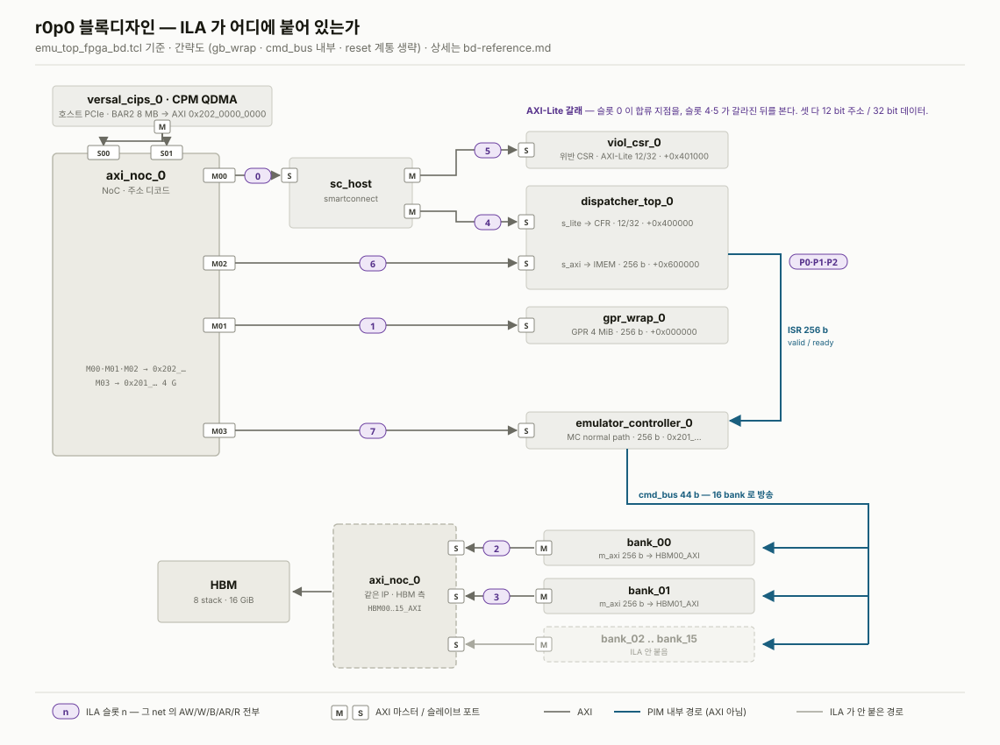
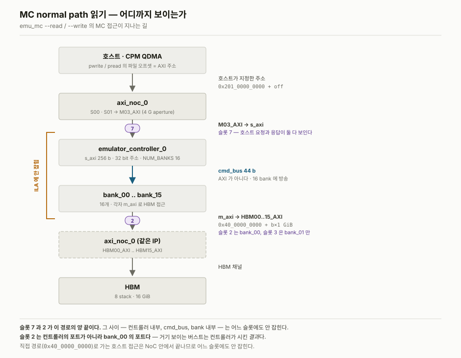

# r0p0 — 블록디자인 참조 (ILA 분석용)

ILA 캡처를 해석할 때 필요한 사실만 모은다. **파형에는 슬롯 번호밖에 없고, 그
번호가 어느 인터페이스인지는 여기에만 있다.**

출처: 커밋 **`75535c5`** 의 `emu_top_fpga_bd.tcl`
(`…/emulator_top/fpga_verify/bd/`, Vivado 2025.2 `write_bd_tcl` 출력)
+ 캡처 `../../../SW/ila_20260805_2027/` 의 신호 폭 교차확인.

**블록디자인이 바뀌면 슬롯 번호가 밀린다.** 리비전이 올라가면 이 문서를 새로 쓸 것.
아래 슬롯 지도는 `75535c5` 에서만 유효하다.

---

## 1. ILA 구성

| | |
|---|---|
| IP | `axis_ila_0` (xilinx.com:ip:axis_ila:1.3) |
| 깊이 | `C_DATA_DEPTH` **16384** 샘플 |
| 모니터 슬롯 | **8개** (`C_NUM_MONITOR_SLOTS`), 전부 AXI |
| 채널 | 슬롯마다 AW/W/B/AR/R 전부 data+trig 로 잡힘 |
| 별도 프로브 | 3개 (아래) |
| 입력 파이프 | `C_INPUT_PIPE_STAGES` 3 — **파형이 실제보다 3 클럭 늦다** |

별도 프로브 3개 — ISR 스트림을 직접 본다:

| 프로브 | 신호 | 폭 |
|---|---|---|
| 0 | `dispatcher_top_0_s_isr_data` | 256 b |
| 1 | `dispatcher_top_0_s_isr_valid` | 1 b |
| 2 | `emulator_controller_0_s_isr_ready` | 1 b |

---

## 2. 슬롯 지도

[](assets/bd-ila-slots.svg)

*[`bd-ila-slots.svg`](assets/bd-ila-slots.svg) — 어느 net 에 어느 슬롯이 붙어
있는지. `M`/`S` 는 AXI 마스터/슬레이브 포트다. `gb_wrap`, `cmd_bus` 내부, reset
계통은 생략했다.*

| 슬롯 | 인터페이스 | 폭 (addr/data/id) | 무엇을 보는가 |
|---|---|---|---|
| **0** | `axi_noc_0/M00_AXI` ↔ `sc_host/S00_AXI` | 64 / **32** / 2 | 호스트 → **AXI-Lite 갈래 전체** (CFR + 위반 CSR 합류 지점) |
| **1** | `axi_noc_0/M01_AXI` ↔ `gpr_wrap_0/s_axi` | 64 / 256 / 2 | 호스트 → **GPR** |
| **2** | `bank_00/m_axi` ↔ `axi_noc_0/HBM00_AXI` | 64 / 256 / 4 | **bank 0** → HBM |
| **3** | `bank_01/m_axi` ↔ `axi_noc_0/HBM01_AXI` | 64 / 256 / 4 | **bank 1** → HBM |
| **4** | `sc_host` 출력 ↔ `dispatcher_top_0/s_lite` | **12** / **32** / — | 호스트 → **CFR** (타이밍·PROG_LEN·도어벨·STATUS) |
| **5** | `sc_host` 출력 ↔ `viol_csr_0/s_axi` | **12** / **32** / — | 호스트 → **위반 CSR** |
| **6** | `axi_noc_0/M02_AXI` ↔ `dispatcher_top_0/s_axi` | 64 / 256 / 2 | 호스트 → **IMEM** |
| **7** | `axi_noc_0/M03_AXI` ↔ `emulator_controller_0/s_axi` | 64 / 256 / 2 | 호스트 → **MC normal path** |

슬롯 0~3, 6, 7 은 TCL 의 `connect_bd_intf_net` 에 명시돼 있다. **슬롯 4·5 는
TCL 을 끝까지 보지 못했고, 설계자 확인으로 확정했다** — 폭이 `araddr[11:0]` /
`rdata[31:0]` 로 `LITE_ADDR_WIDTH {12}` / `LITE_DATA_WIDTH {32}` 와 맞는 것까지가
캡처에서 나온 사실이고, 둘 중 어느 쪽인지는 캡처로는 갈리지 않았다.

> 슬롯 **4 = CFR** 은 이 설계에서 유일하게 **호스트가 쓰기를 보내는 AXI-Lite** 다
> (위반 CSR 은 `CTRL` 말고는 읽기 전용). 도어벨이 실제로 언제 떨어지는지 보려면
> 여기를 잡는다.

### 슬롯 고르기 — 어느 도구를 볼 때 어디를 보는가

| 도구 | 볼 슬롯 |
|---|---|
| `emu_sanity` | 0 (합류), **4** (CFR write/readback), **5** (위반 CSR 읽기) |
| `emu_gpr_loop` | **1** ← r0p0 §2.2 를 푸는 곳 |
| `emu_gemv` (IMEM 적재) | 6, 그리고 프로브 0~2 (ISR 스트림) |
| `emu_mc --read` / `emu_mc --write` | **7** (호스트 요청) + **2·3** (bank 0·1 의 HBM 접근) |
| `emu_hbm_direct` | 2·3 만. 호스트 직접 경로는 NoC 안이라 안 잡힌다 |

MC 읽기 캡처(2026-08-05)에서 실제로 활동한 슬롯은 **2 와 7 뿐**이었다
(AR 245 / 219 회, AW 0). 나머지 6개는 0회 — 즉 **GPR·IMEM·AXI-Lite 는 그 캡처에
증거가 없다.**

---

## 3. 주소 라우팅 — NoC

호스트(QDMA)는 `S00_AXI`/`S01_AXI` 로 들어와 마스터 포트 4개로 갈린다.

| NoC 포트 | 구경(aperture) | 가는 곳 |
|---|---|---|
| `M00_AXI` | `0x202_0000_0000` 1 G | `sc_host` → CFR, 위반 CSR |
| `M01_AXI` | `0x202_0000_0000` 1 G | `gpr_wrap_0/s_axi` |
| `M02_AXI` | `0x202_0000_0000` 1 G | `dispatcher_top_0/s_axi` (IMEM) |
| `M03_AXI` | `0x201_0000_0000` **4 G** | `emulator_controller_0/s_axi` |

`DEST_IDS`: `M00=0xc0  M01=0x80  M02=0x40  M03=0x100`

`HBM00_AXI`..`HBM15_AXI` ← `bank_00`..`bank_15` 의 `m_axi`.
NoC 쪽 대응은 `HBM00→HBM0_PORT0`, `HBM01→HBM0_PORT2`, `HBM02→HBM1_PORT0`,
`HBM03→HBM1_PORT2`, … 즉 **`HBM(n)_AXI → HBM(n/2)_PORT(0 또는 2)`** 다.
`PORT1`/`PORT3` 은 쓰지 않는다.

BAR2 → AXI: `CPM_PCIE0_PF0_PCIEBAR2AXIBAR_QDMA_2 = 0x202_0000_0000`, BAR2 크기 8 MB.

---

## 4. 블록 파라미터

| 블록 | 파라미터 |
|---|---|
| `dispatcher_top_0` | `FULL_ADDR_WIDTH 19` `FULL_DATA_WIDTH 256` `FULL_ID_WIDTH 4` **`GPR_AW 17`** **`IMEM_AW 14`** `LITE_ADDR_WIDTH 12` `LITE_DATA_WIDTH 32` `TW 8` |
| `gpr_wrap_0` | **`AW 17`** `DW 256` → 2¹⁷ × 32 B = 4 MiB |
| `emulator_controller_0` | `AXI_ADDR_WIDTH 32` `AXI_DATA_WIDTH 256` `AXI_ID_WIDTH 4` **`BANK_OFFSET_W 30`** `NUM_BANKS 16` `TW 8` |
| `bank_00`..`15` | `AXI_ADDR_WIDTH 64` `AXI_DATA_WIDTH 256` `AXI_ID_WIDTH 4` **`OFFSET_ADDR_WIDTH 30`** `S_CMD_WIDTH 44` |
| `viol_csr_0` | `LITE_ADDR_WIDTH 12` `LITE_DATA_WIDTH 32` |

`bank_nn` 의 `BASE_ADDR` 은 34비트이고 **상위 주소 비트**다:
`BASE_ADDR << 30` 이 그 bank 의 직접 창이 된다.
bank_00 = `0x100 << 30` = `0x40_0000_0000`, bank_01 = `0x101 << 30` = `0x40_4000_0000`
— SW 의 `EMU_HBM_BANK(b)` 와 일치한다 (1 GiB 간격).

### `BANK_OFFSET_W = 30` — 해소됨 `[실측]`

SW(`emu_regs.h`, README §2.1)는 MC 창이 `{bank[3:0], offset[27:0]}` 로
**16 bank × 256 MiB** 를 담는다고 가정한다. 그런데 `emulator_controller_0` 는
`BANK_OFFSET_W = 30` 이고 `AXI_ADDR_WIDTH = 32` 라서, 액면대로면 bank 필드가
`addr[33:30]` 인데 **주소가 32비트뿐이라 상위 2비트가 없고** → `addr[31:30]`
2비트, 즉 **4 bank × 1 GiB** 만 지목되는 것 아니냐는 의심이 있었다.

**아니다.** `./emu_mc --read --bank 4 --kib 32` 로 MC 슬롯 4(`0x201_4000_0000`)를
읽었더니 되돌아온 패턴의 bank 필드가 **4** 였다:

```
got 0xc5a17_4_0000000030   →  magic 0xc5a17 · bank 4 · offset 0x30
```

슬롯 4 가 HBM bank 4 를 가리킨다. `addr[31:30]` 2비트 모델이었다면 bank 1 이
나왔어야 하고, 슬롯 3(`bank_01`)에 트래픽이 떴을 것이다.

**SW 의 `{bank[3:0], offset[27:0]}` 가정이 맞다.** 다만 슬롯 4 하나만 확인한
것이므로, 16 슬롯 전수는 `./emu_mc --read` 로 아직 확인할 것.

---

## 5. 데이터 경로 — MC normal path 읽기

`emu_mc` 의 MC 접근이 지나는 길. 슬롯 7 과 2 가 이
경로의 양 끝이고, 사이는 ILA 에 안 잡힌다.

[](assets/mc-read-path.svg)

*[`mc-read-path.svg`](assets/mc-read-path.svg) — 관측 가능한 두 지점과 그 사이의
사각지대.*

**슬롯 2 는 컨트롤러의 포트가 아니라 `bank_00` 의 포트다.** 슬롯 2 에서 보이는
버스트는 컨트롤러가 시킨 대로 bank 0 이 실행한 결과이지, 컨트롤러 자신의
요청이 아니다 — [report.md §2.1](report.md) 이 이 구분 위에 서 있다.

직접 경로(`0x40_0000_0000`, `emu_hbm_direct` 와 `emu_mc --read` 의 write)는 호스트에서
NoC 를 지나 곧장 HBM 으로 가므로 **어느 슬롯에도 안 잡힌다.**
