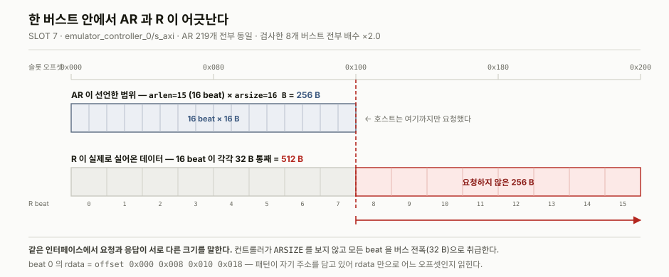
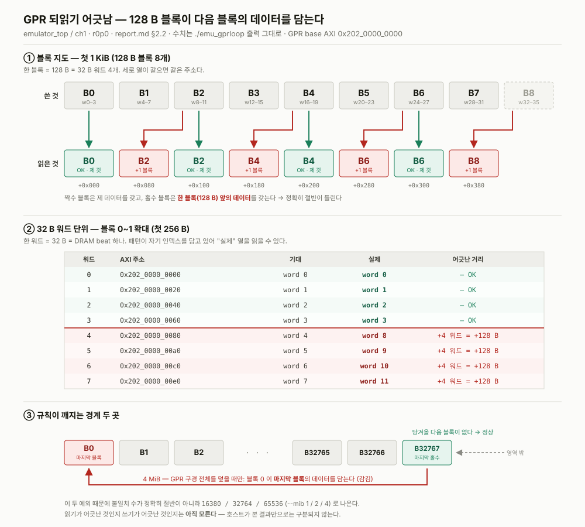

# emulator_top / ch1 — r0p0 하드웨어 문제 기록

**r0p0 은 첫 하드웨어 리비전이다.** 이 문서는 이 리비전에서 **하드웨어 쪽 원인으로
확인되었거나 의심되는 것**만 모은다. 호스트 코드의 주소·전송 규약은
[SW/README.md](../../../SW/README.md), ISR·타이밍 정본은
[HANDOFF.md](../HANDOFF.md) 다. 그림은 [`assets/`](assets/) 에 있다.

출처 표기는 SW 쪽과 같은 규약을 쓴다 —
`[실측]` 보드/ILA 에서 직접 관측, `[유도]` 규격이나 관측에서 계산했으나
끝까지 확인하지는 않음, `[미확인]` 아직 아무것도 확인하지 않음.

---

## 0. 이 리비전은 무엇인가

| | |
|---|---|
| **소스 커밋** | **`75535c5`** — 이 리비전의 RTL·블록디자인 |
| PDI | `emu_top_fpga_wrapper.pdi` — 2026-08-05 16:36 빌드 |
| LTX | `emu_top_fpga_wrapper.ltx` — 이 빌드는 **ILA 를 포함한다** |
| 상태 | 계층 1(`emu_sanity`) 미실행. 계층 2 에서 **미해결 결함 2건** |

이 문서의 모든 관측은 **커밋 `75535c5` 로 만든 비트스트림**에서 나온 것이다.
소스가 바뀌면 리비전을 올리고 이 문서를 새로 시작할 것 — 관측과 비트스트림이
어긋나는 순간 여기 적힌 것이 전부 근거를 잃는다.

ILA 가 들어 있는 것이 중요하다 — §2.1 은 그것이 없었으면 찾지 못했을 결함이다.

---

## 1. 주소 맵

`[블록디자인]` `assign_bd_address` 출력. **보드에서 확인하지 않았다.**

| 블록 | AXI | 크기 | BAR2 오프셋 | 무엇 |
|---|---|---|---|---|
| `gpr_wrap_0/s_axi` | `0x202_0000_0000` | 4 M | `+0x000000` | GPR |
| `dispatcher_top_0/s_lite` | `0x202_0040_0000` | 4 K | `+0x400000` | CFR |
| `viol_csr_0/s_axi` | `0x202_0040_1000` | 4 K | `+0x401000` | 위반 CSR |
| `dispatcher_top_0/s_axi` | `0x202_0060_0000` | 512 K | `+0x600000` | IMEM |
| `emulator_controller_0/s_axi` | `0x201_0000_0000` | 4 G | — | MC normal path |

미디코드로 남는 구간은 `+0x402000..0x5FFFFF` 와 `+0x680000..0x7FFFFF` 이고,
`0xffffffff` 로 읽혀야 한다 — **보드에서 처음 확인할 것**이다. `emu_sanity` 의
all-ones 검사가 여기에 걸린다.

> **GPR 이 CFR 과 맞닿아 있다.** GPR 은 `+0x3FFFFF` 에서 끝나고 그 다음 바이트가
> CFR 이다. CFR 은 `addr[7:0]` 만 디코드해 256 B 마다 반복되므로 하위 바이트가
> `0x00` 인 오프셋은 어디든 `CTRL` 이고, 그 비트 0 이 **도어벨**이다. 즉 GPR
> word 인덱스가 범위를 넘은 DMA 쓰기는 **커널을 실행시킨다.** 호스트 쪽에서는
> `emu_regs.h` 가 AXI-Lite 창으로 가는 DMA 를 거부해 막고 있다.

---

## 2. 발견된 문제

### 2.1 `emulator_controller_0/s_axi` 가 **ARSIZE 를 무시한다** `[실측]`

MC normal path 읽기가 호스트에게 잘못된 데이터를 준다. 원인은 컨트롤러의
슬레이브 읽기 데이터 경로가 **ARSIZE 를 보지 않고 모든 beat 을 버스 전폭(32 B)
으로 취급**하는 것이다.

**증거** — `../../../SW/ila_20260805_2027/`, **MC 읽기**(`emu_mc --read`) 실행 중 캡처, 트리거 sample 2048 / 16384.
ILA 슬롯 대응은 §4.

같은 인터페이스(slot 7)의 AR 과 R 이 서로 모순된다.

AR 219개 **전부** 동일하다:

| 신호 | 값 | 뜻 |
|---|---|---|
| `arlen` | 15 | 16 beat |
| `arsize` | **16 B** | beat 당 16 B |
| 버스트 크기 | 16 × 16 B = **256 B** | |
| AR 주소 증가분 | `0x100` = **256 B** | 버스트 크기와 일치 |

호스트 쪽은 완전히 일관된다 — 256 B 를 요청하고 주소도 256 B 씩 나아간다.
그런데 되돌아오는 R 은 16 beat 이 각각 **32 B 를 통째로** 싣고 온다:

[](assets/arsize-mismatch.svg)

*[`arsize-mismatch.svg`](assets/arsize-mismatch.svg) — 같은 주소축 위에 AR 이
선언한 범위와 R 이 실제로 실어온 범위를 겹쳐 놓은 것.*

**256 B 를 요청한 버스트에 512 B 가 실려 온다.** 검사한 8개 버스트 전부
배수 정확히 ×2.0.

패턴(`emu_mc` 의 `magic|bank|offset`)이 자기 주소를 담고 있어서 rdata 만으로
어느 오프셋의 데이터인지 그대로 읽힌다.

**나머지가 전부 이 하나로 설명된다.** 슬롯 2 는 컨트롤러가 아니라 **`bank_00` 의
HBM 포트**이므로(§4), 거기 보이는 것은 컨트롤러가 시킨 결과다:

- 컨트롤러는 호스트 요청을 `16 beat × 32 B = 512 B` 로 오해한다 →
  bank 0 이 HBM 에서 **512 B 를 읽는다** (`arlen=15, arsize=32 B`) `[실측]`
- 호스트의 다음 요청은 **+256 B** 에서 온다 (호스트는 256 B 만 받았다고 여기므로)
  → bank 0 의 512 B 읽기가 **256 B 간격**으로 나간다 =
  **HBM 을 절반씩 두 번 읽는다. HBM 트래픽이 2배다.** `[실측]`
- 슬롯 2 의 `arlen=7`(256 B) 54개는 4 KB 경계를 넘는 512 B 버스트가 쪼개진 것이다.
  주소 하위 12비트가 `0x700`/`0x800`/`0xf00`/`0x000` 에 몰려 있다 `[실측]`

**호스트가 실제로 받는 것** `[실측 — 유도한 뒤 호스트 쪽에서 확인]`

AXI narrow read 규격상 마스터는 beat `n` 의 유효 16 B 를 `(주소 + 16n) mod 32`
레인에서 뽑는다. 짝수 beat 은 하위 16 B, 홀수 beat 은 상위 16 B 를 가져간다:

| beat | 호스트 버퍼 위치 | 실제로 담기는 데이터 | |
|---|---|---|---|
| 0 | `0x000-0x00f` | `0x000-0x00f` | OK |
| 1 | `0x010-0x01f` | `0x030-0x03f` | X |
| 2 | `0x020-0x02f` | `0x040-0x04f` | X |
| 3 | `0x030-0x03f` | `0x070-0x07f` | X |
| 4 | `0x040-0x04f` | `0x080-0x08f` | X |

**버스트마다 첫 16 B 만 맞고 나머지 240 B 가 틀린다.** 규칙은
`호스트 오프셋 H → 데이터 오프셋 2H (+16 if (H/16) 홀수)` — 주소가 2배로 늘며
16 B 씩 건너뛰어 읽힌다.

**이 표를 호스트 쪽에서 확인했다** — `./emu_mc --read --bank 4 --kib 32`:

```
 4 | 0x20140000000      | BAD 3840/4096 words in 1024/1024 beats
   FIRST DIVERGENCE at slot offset 0x000000010 (16 B into the slot)
     expected 0xc5a1740000000010
     got      0xc5a1740000000030   the pattern for offset 0x30, +32 B from here
   NOT a clean tail: 2032 B after +0x000000010 are still correct
```

| 예측 | 실측 | |
|---|---|---|
| beat 1 (호스트 `0x010`) ← 데이터 `0x030` | `0x030` | 일치 |
| 버스트당 240/256 B 오류 = 93.75 % | 3840/4096 워드 = **93.75 %** | 일치 |
| 정상 바이트 = 128 burst × 16 B = 2048 B | 32768 − 30720 = **2048 B** | 일치 |

세 수치가 전부 맞는다. **§2.1 은 이제 유도가 아니라 양쪽에서 관측된 사실이다.**

**고칠 곳** — 둘 중 하나

1. **컨트롤러가 `ARSIZE` 를 존중**하도록 고친다. narrow 버스트면 beat 당
   `2^ARSIZE` 바이트만 규격이 정한 레인에 실어 보낸다. 정공법이지만 컨트롤러에
   narrow 처리 로직이 필요하다.
2. **블록디자인에서 폭을 맞춘다.** 마스터가 256 b 포트에 16 B 버스트를 쏘는
   이유부터 봐야 한다. QDMA 데이터폭이 128 b 인데 업사이저 없이 256 b 슬레이브에
   붙었다면, AXI Interconnect/SmartConnect 의 폭 변환을 넣는 것이 RTL 을 안
   건드리는 해법이다. 제대로 된 업사이저는 슬레이브 쪽에 `arsize=32 B` 로
   정리해서 내보낸다.

`arsize=16 B` 가 AR 219개 **전부**에 일관되게 찍혀 있다. 간헐적 현상이 아니라
**연결 구성의 문제**이므로 2번을 먼저 확인할 것.

---

### 2.2 GPR 되읽기가 128 B 블록 단위로 어긋난다 `[실측 — 원인 미상]`

`emu_gpr_loop` 이 실패한다. **§2.1 과는 다른 결함**이다 (아래 대조표).

**증상** — 세 크기 실측, 모델과 오차 0

| `--mib` | 워드 수 | 불일치 | 모델 예측 |
|---|---|---|---|
| 1 | 32768 | 16380 | 16380 |
| 2 | 65536 | 32764 | 32764 |
| 4 | 131072 | 65536 | 65536 |

**모델** — 128 B 블록(= 32 B 워드 4개) 단위. **홀수 블록이 한 블록 앞(+128 B)의
데이터를 담는다.** 짝수 블록은 정상. 그래서 정확히 절반이 틀린다.

경계 두 곳이 예외다:

- **마지막 홀수 블록은 정상** — 당겨올 다음 블록이 영역 밖이라 그렇다
  (그래서 매번 4 워드씩 덜 틀린다)
- **4 MiB(= GPR 구경 전체)일 때만 블록 0 이 마지막 블록을 담는다** — 구경 전부를
  덮을 때만 나오는 감김(wrap)

주소와 워드 단위로 어디가 어떻게 어긋나는지는 도해를 볼 것:

[](assets/gpr-shift.svg)

*[`gpr-shift.svg`](assets/gpr-shift.svg) — ① 블록 지도(첫 1 KiB), ② 32 B 워드 단위 확대
(첫 256 B, AXI 주소·기대·실제), ③ 규칙이 깨지는 경계 두 곳. 수치는
`./emu_gpr_loop` 출력 그대로다.*

**§2.1 의 ARSIZE 가설로는 설명되지 않는다:**

| | GPR (§2.2) | MC (§2.1) |
|---|---|---|
| 틀리는 비율 | 정확히 **1/2** | 버스트당 **15/16** |
| 모양 | 128 B 블록이 다음 블록을 복제 | 주소 2배 확대 |
| 32 B 워드 하나 | **통째로** 다른 워드의 데이터 | 앞 16 B / 뒤 16 B 가 **서로 다른 곳**에서 옴 |

narrow 모델이면 워드가 반반씩 섞여야 하고 `emu_gpr_loop` 은 그것을
*"right index, corrupted payload"* 로 보고했을 것이다. 실제로는
*"holds word 131068's data"* — **온전한 다른 워드**다.

**주소 맵 문제도 아니다.** 맵이 틀렸으면 통째로 밀리거나 접히지, 128 B 마다
규칙적으로 번갈아 나오지 않는다. GPR 이 `+0x000000` 에 있는 것 자체는 맞다.

**NoC/HBM 읽기 경로는 이 리비전에서 정상으로 관측되었다** `[실측]` — §2.1 의 ILA
에서 slot 2(컨트롤러 → HBM)의 R 데이터는 오프셋이 순서대로 빠짐없이 올라왔다.
따라서 GPR 문제는 그 아래가 아니라 **GPR 슬레이브 쪽**에서 봐야 한다.

**다음 단계**

1. **`emu_gpr_loop` 을 돌리며 캡처**해 `gpr_wrap_0/s_axi` 의 **`arsize` 를 확인**한다.
   `16 B` 면 §2.1 과 원인이 하나(폭 불일치)로 합쳐지고, `32 B` 면 별개다.
   이 한 가지로 갈린다.
   > **비트스트림을 새로 만들 필요가 없다.** 그 인터페이스는 이미 **슬롯 1** 에
   > 걸려 있다(§4, [bd-reference.md](bd-reference.md)). 2026-08-05 캡처는
   > MC 읽기 중이라 슬롯 1 의 핸드셰이크가 0회였을 뿐이다.
2. 이미 적어둔 용의자 — `emu_gpr_wrap.v` 는 GPR 의 단일 read-return 을
   **1비트 owner 레지스터**로 구분한다. 이것은 메모리가 읽기 진행 중 새 명령을
   거부해야만 충분하다. `gpr.v` 가 드롭에 없어 확인할 수 없고, **여러 요청이
   동시에 떠 있는 버스트 읽기가 바로 이것을 깨뜨릴 것**이다.
3. 읽기냐 쓰기냐 — `emu_gpr_loop` 에 쓰기/읽기 청크 크기를 따로 주는 옵션을
   넣어 한쪽만 잘게 쪼개면 갈린다.

---

## 3. 검증 상태

| 항목 | 상태 |
|---|---|
| 주소 맵 4개 창 | **미확인** — `emu_sanity` 미실행 |
| 미디코드 구간이 `0xffffffff` 인지 | **미확인** |
| CFR write/readback | **미확인** |
| 위반 CSR 창 | **미확인** |
| GPR DMA 왕복 | **실패** — §2.2 |
| HBM 직접 경로 | 미실행 |
| MC 읽기 경로 | **결함 확인** — §2.1 |
| MC 쓰기 경로 | 미실행 |
| ISR 실행 (GEMV) | 미실행 |

**계층 1 이 열려 있다.** `emu_sanity` 를 먼저 통과시키지 않으면 위 실패들의
원인이 섞인다 — 주소 맵이 틀린 것인지 데이터 경로가 틀린 것인지 구분되지 않는다.

---

## 4. 이 기록이 쓴 ILA 캡처

**슬롯 지도와 블록 파라미터 전체는 [bd-reference.md](bd-reference.md) 에 있다.**
파형에는 슬롯 번호밖에 없고 그 번호가 무엇인지는 거기에만 있다.

캡처: [`../../../SW/ila_20260805_2027/`](../../../SW/ila_20260805_2027/)

| | |
|---|---|
| 실행 중이던 것 | MC 읽기 (`emu_mc --read`) |
| 캡처 시각 | 2026-08-05 20:27 (PDI 빌드 16:36 과 같은 날) |
| 트리거 | sample **2048** / 16384 |
| 활동한 슬롯 | **2 와 7 뿐** — 나머지 6개는 핸드셰이크 0회 |

§2.1 이 쓴 두 슬롯:

| 슬롯 | 인터페이스 | 이 기록에서의 역할 |
|---|---|---|
| **7** | 호스트 → `emulator_controller_0/s_axi` | 요청과 응답이 모순되는 그 인터페이스 |
| **2** | **`bank_00/m_axi`** → `axi_noc_0/HBM00_AXI` | 컨트롤러가 시킨 결과. **컨트롤러 자신의 포트가 아니다** |

컬럼 382개 중 분석에 쓴 것 26개. R 핸드셰이크 슬롯당 3488 beat.

> **AW 핸드셰이크가 0회다** — 이 캡처에는 쓰기 증거가 전혀 없다. MC 쓰기 경로를
> 볼 때는 새로 캡처해야 한다.

---

## 5. 다음에 할 것

1. **`emu_sanity`** — 계층 1 을 닫는다. 주소 맵 4개 창과 미디코드 구간 확인
2. **`gpr_wrap_0/s_axi` ILA** — `arsize` 하나로 §2.2 가 §2.1 과 합쳐지는지 갈린다
3. **§2.1 수정** — 폭 변환(블록디자인) 쪽을 먼저
4. 수정 후 `emu_mc --read` / `emu_mc --write` 재실행
5. `emu_hbm_direct`, `emu_gemv` — 아직 돌리지 않았다
